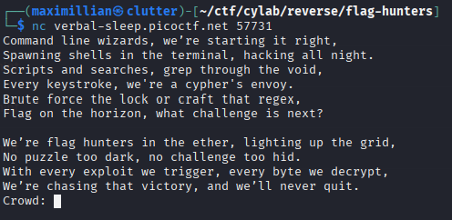
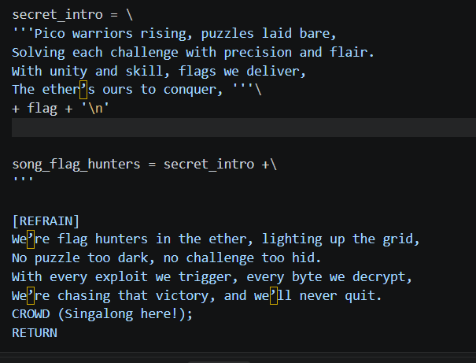
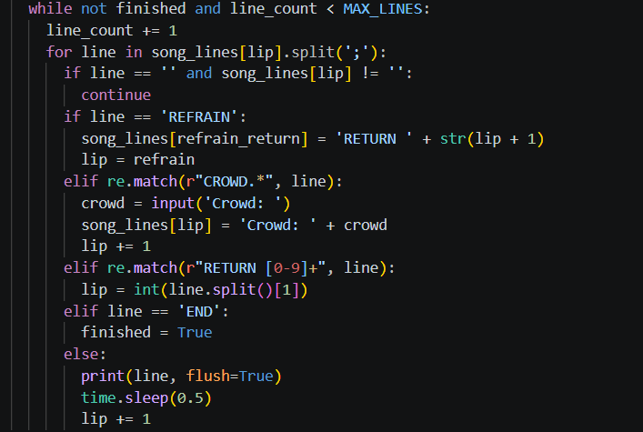
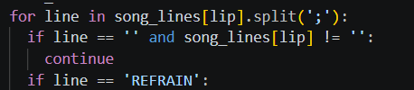
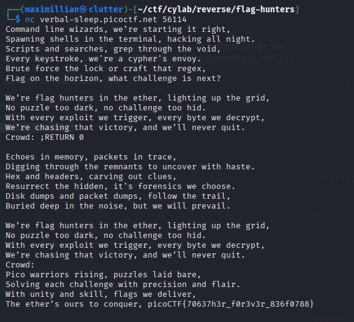

# Flag Hunters
Category: Reverse Engineering
Difficulty: Easy
File Type: Python
Tools Used: Terminal / Powershell to run script and any text editor (I used VSC)

## 1. Get To Know The Challenge
This challenge gave us 1 file that is the source code of the program itself (lyric-reder.py)

The program itself is expecting user input for it to continue.

## 2. Breaking the Code Logic
Inside of the code, we get to see that the program contains the flag in the lyrics.

Which means we need the program to give us that exact flag line. But here's the problem, even though the flag part is on top of the lyrics, the program start printing the lyrics from '[VERSE 1]'. But there's a loop to it.

-> Unsanitized User Input
Inside of the code we get to see that there's the regex which find a matching string pattern for "CROWD" and that particular elif statement will take user input, after gettint the user input that block of code will change the same line with "Crowd: + [User Input]" permanently. 

After that elif statement we also get to see that there's also a regex that searches for "RETURN [num]" and that block of code will get the program to start printing from 0 (Top of the song) if we can input RETURN 0.

But there's also another problem, this particular regex will only be true if RETURN 0 is in the front of the line. We can exploit this by putting ';' just before the RETURN 0. This will make the program thinks that Crowd: and RETURN 0 is a different part of the lyrics making RETURN 0 be most front string.

## 3. Exploiting the Code
After knowing what to actually do, we can start exploiting the program. And when the program is expecting our input, we can simply put ";RETURN 0"

Which get us the flag, and the challenge is solved.
