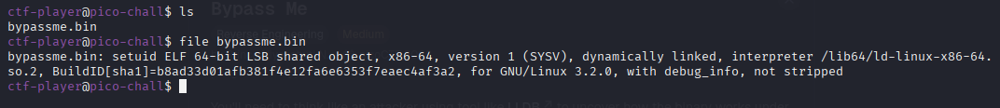
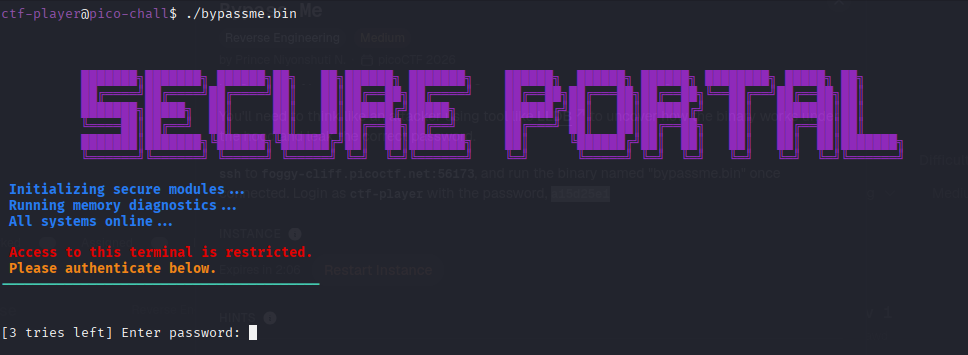
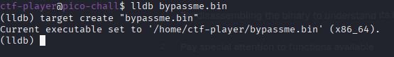
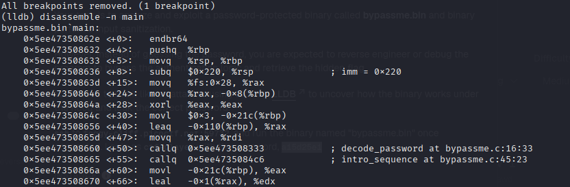
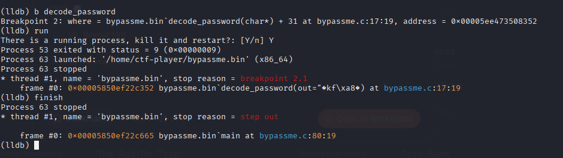
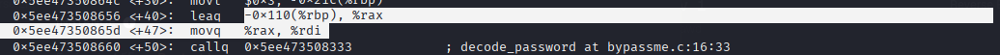
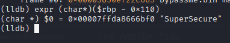
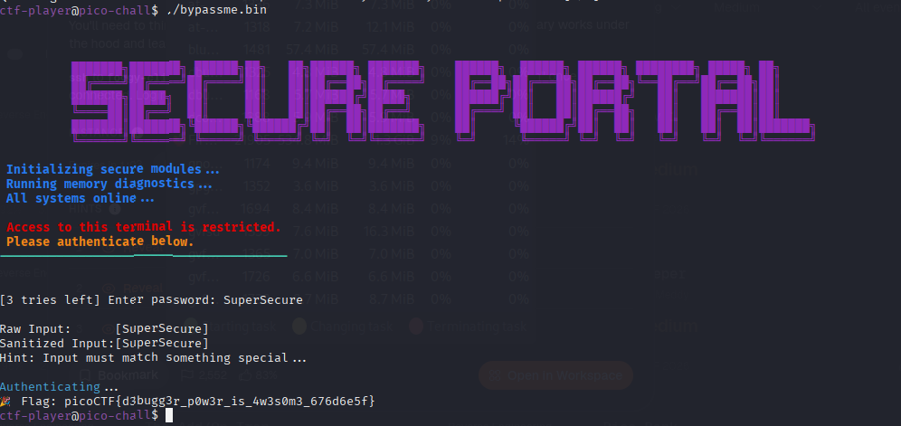

# Bypass Me

**Category:** Reverse Engineering\
**Difficulty:** Medium\
**File Type:** bin\
**Tools Used:** `lldb`

## 1. Initial Step
Firstly, this challenge required us to connect to its server using ssh.

```
ssh ctf-player@foggy-cliff.picoctf.net -p 56173 
```

After connecting to the server, we can see the listed file, there is an ELF file.



After executign the ELF file, to conntinue the execution, the program is askinng us for the password.



## 2. Debugging the ELF file



Since the program requires a password to continue, we need to try and debug the program to search for the password. We can debug this program using a tool like lldb.

```
(lldb) disassemble -n main
```

We can disassemble the main function of the program, to read all the raw machine instructions.



Inside of it, we get to see there's a decode_password which we can assume that it will contain the password.

## 3. The Execution



We can set a breakpoint at decode_password and run the program then finish it, the reason is because we don't want the program to continue doing the other stuff, just until the password is finished being decoded and stored.



We can see here, that the output (password) of the function will be stored in -0x110(%rbp) a memory box.



Now all we need to do is look inside of the box, by using 

```
expr (char*) ($rbp - 0x110)
```

This will read the memory, converted the bytes to text and will hand us the real password.



After running the program and inputting the password, we'll get the flag.
