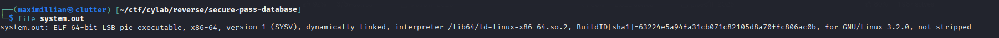
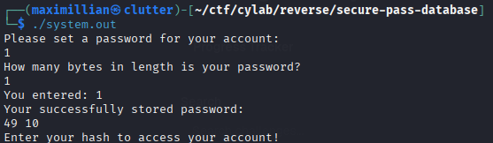
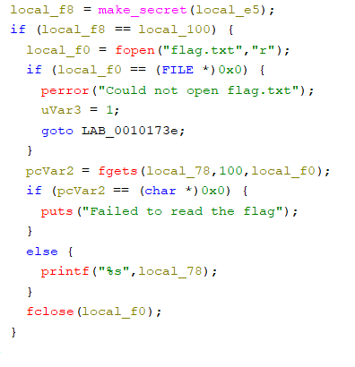
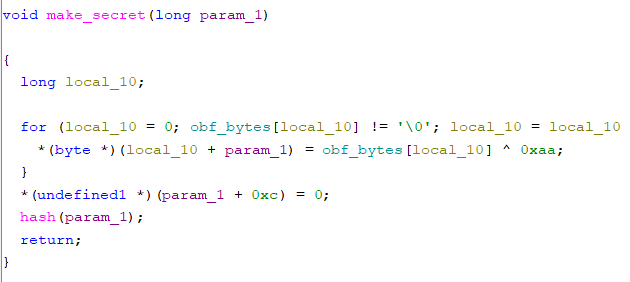
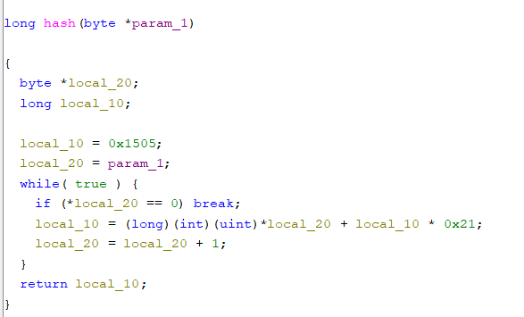
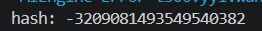
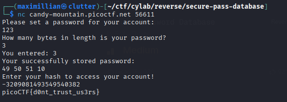

# Transformation
Category: Reverse Engineering
Difficulty: Medium
File Type: ELF
Tools Used: Terminal / Powershell to run script and any text editor (I used VSC)

## 1. Initial Reconnaissance
First we'll try to identify what's the file type using file in our linux terminal.



As we can see, it's a ELF file type. Which means it's a linux executable.



Executing it, will ask us to set a password and the byte length of the password. Lastly It will also ask us about hash to access our account.

## 2. Breaking down the code
Since it's an executable file, we need to decompile it using ghidra. Ghidra is used here to represent the logic of the program in pseudo-C, using it will help us understand better how the program works.



Inside of the main function of the program, we'll see that there's an if statement that compares local_100 (User Input) with local_f8 (Output of make_secret function) and that if statement will give us a flag if it's true. So to get the flag, we need to get the output of make_secret function.



Inside of make_secret function, we'll get to see that there are some variables, one of them is param_1 which get past as a parameter. Here we can see there's a for loop that overwrites param_1 values with obf_bytes[local_10] XOR 0xaa. To get what the values of the XOR is we'll need the bytes inside of obf_bytes (By double clicking it in Ghidra) and write it down as a new variable in vsc or any IDE.



Continuing to the hash function, we will ses that param_1 doesn't just stop at make_secret function. It values will be copied to a new variable local_20. Then there's another new variable local_10 which value will be multiplied with 0x21 then additioned with local_20.

Since we got all the important part and the logic, all we need to do is rewrite the code in C.

## 3. Rewriting the Code
Using the same logic of the program, we can write it all down in C.

```
#include <stdio.h>

long long hash(unsigned char *param_1) {
    unsigned char *local_20;
    long long local_10;
  
    local_10 = 0x1505;
    local_20 = param_1;
    
    while(1) {
        if (*local_20 == 0) break;
        local_10 = *local_20 + local_10 * 0x21;
        local_20++;
    }
    return local_10;
}

int main(void) {
    unsigned char obs_bytes[] = {0xc3, 0xff, 0xc8, 0xc2, 0x92, 0x9b, 0x8b, 0xc0, 0x80, 0xc2, 0xc4, 0x8b, 0x00};
    unsigned char param_1[14];
    int i;

    for (i = 0; obs_bytes[i] != '\0'; i++) {
        param_1[i] = obs_bytes[i] ^ 0xaa;
    }

    param_1[i] = '\0';
    

    printf("hash: %lld", hash(param_1));

    return 0;
}
```

Running it will get us the hash.



And all we got to do now is testing it inside of the instance.



With that we beat the challenge.
